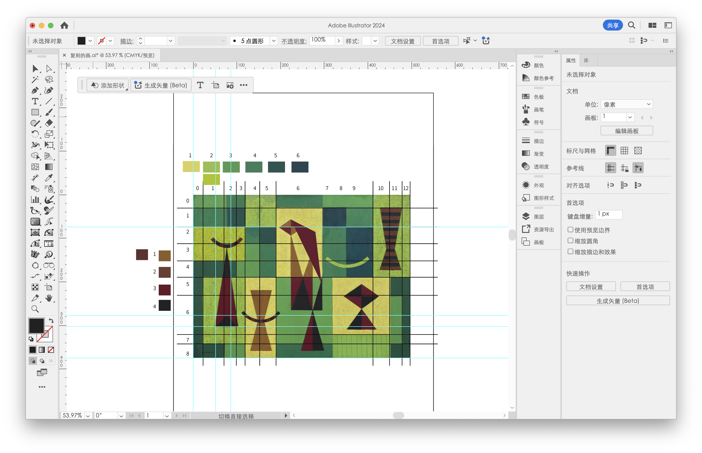

# Assignment 1 : Geometric Abstraction

---

## Progress

### Step 1: Setting up the base image

I first used Illustrator to match the original image’s full proportions and colors on a 400×500 pixel canvas.

The original image is here:  




Basically, I used Illustrator just to measure and plan. It helped me know exactly how big each block should be when I later recreate everything with code.

### Step 2 : Creating Background Grid with Array and For Loop

I divided the background into a 13×9 grid of rectangles with varying width and height, using variables, arrays, and cumulative sums to draw each row of the green checkerboard background.

Defined arrays for `colWidths` and `rowHeights` to simulate a flexible layout system.
Used cumulative sums (`xPos[]` and `yPos[]`) to precalculate drawing anchor points.

I explain everything about why I used them and how to use them inside the code.

### Step 3 : Using Customized Function

Since the grid drawing code was getting long, I wrapped it in a function called `drawComplexBackground()`. I then placed the function call inside `draw()`, so when interactive animations are added later, each frame clears and redraws the previous one.

### Step 4 : Drawing Front Screening Elements

I drew the dark color parts in the foreground of the original image. I thought the arc and triangle patterns looked like small characters. I used `arc()` and `triangle()`.

(Since this recreation didn’t require `beginShape()`, `vertex()` and `endShape()`, I didn’t use them here. But I did use them in my Week 2 sketch.js where I drew Hello Kitty.)

### Step 5 : Add Interaction

I added interactive animation to the head of the little triangle characters. The mouse position serves as the source of dynamic data for the head. I added a dynamic offset to the original coordinates to make them move.

Mouse interaction (mouseX, mouseY) as data input.
I offset some coordinates with these variables so parts of the shape could move.

### Step 6 : Drawing Front Screening Elements

I made the whole drawing scalable based on a 500×400 pixel canvas by applying the `scale()` function relative to the window size. This was done by dividing to get a scale factor:

```js
let baseW = 500;
let baseH = 400;

let scaleX = width / baseW;
let scaleY = height / baseH;
scale(scaleX, scaleY);
```

The scale() function in p5.js.
I first defined a base size (500×400), then calculated how much to scale horizontally and vertically.

I divide the actual window width and height by the base size to get scaleX and scaleY,
and then call scale(scaleX, scaleY).
That way, the layout always keeps its proportions no matter what screen size.

---

### Step 7 : Changed the Color Palette

After rebuilding everything. I changed color palette to my personal choice. I kept the original colors, which I extracted in illustrator. I commented them to keep it documented.
