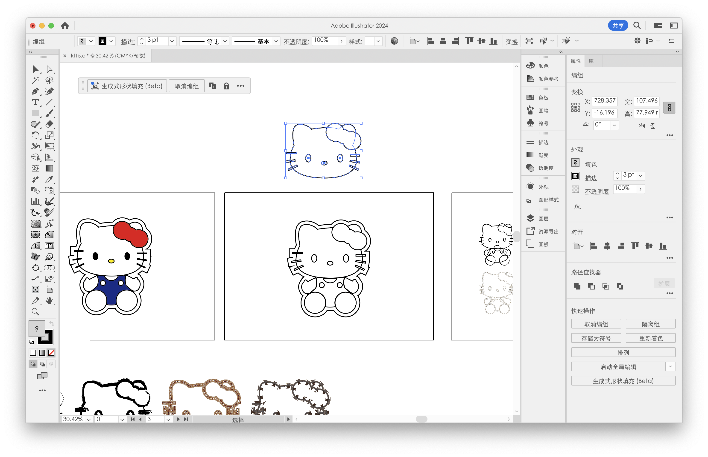

# Assignment 2 : Hello Kitty Grid

## Generative Pattern, Week 4 Assignment

This is a practice sketch.
It draws a grid of Hello Kitty figures that rotate and scale based on mouse position.  
Each time I click the canvas, the bowknot color changes randomly.

This project builds on my **Week 2 work**, where I originally drew a single Hello Kitty.  
In Week 4, I reused that shape using a custom function `drawKT()` and placed it inside a dynamic grid.

---

## Loop Structure: Making a Grid

I use **nested `for` loops** to repeat the Kitty drawing:

If I only used one loop, I could only draw in a single line.  
To draw multiple rows without copy-pasting code 10 times,  
I used a **nested loop**: a loop _inside_ another loop.

- The **outer loop** goes down the screen, one row at a time
- The **inner loop** goes across the screen, drawing figures in that row

- Inside each grid cell:
  - `translate(x, y)` moves the origin to that location
  - `rotate()` makes each Kitty spin based on the mouse’s X position
  - `scale()` changes the Kitty size based on mouse X+Y
  - `drawKT()` is called to draw the Hello Kitty

This makes the grid fully automatic — I can change the spacing or canvas size, and the whole layout adjusts without rewriting any drawing code.

## Mouse Interaction

### Rotation & Scaling

- I use the `map()` function to convert `mouseX` and `mouseY` into:
  - `angle` for rotation (in radians)
  - `scaleFactor` for size change
- This creates a playful motion effect where the whole grid “wiggles” when I move the mouse.

### Click to Change Color

- In `mousePressed()`, I use `random(255)` to generate a new RGB color
- This controls the fill color of the bowknot (`knotColor`)
- Every click = a new color = more surprise and fun!

## drawKT(): Reusing My Week 2 Work

used my previous drawing:

svg files: ./assignment2/SVG

I need converted my svg to p5js code. And I use GPT as a search engine to tell me is whether we have this kind of tool on the internet.
And here it is:
SVG to p5.js CONVERTER, made by Munus Shih.

Basically, this tool takes SVG input, parses it using DOMParser() function, make it readable for javascript. And loop through all the SVG shapes. reads attributes like fill, stroke, geometry... And turn it to p5js code.(like <rect> to rect(), <path> to a group of vertex and bezier). At last, it returns pjs code as string.

I created a custom function `drawKT()` to keep things organized.

- Instead of redrawing the Kitty head, bow, eyes, nose, and whiskers manually each time,
- I wrote one function and **reused it** in each grid cell.
- I also added `translate(-150, -120)` to re-center the drawing.

Why use a custom function?  
This helps me **modularize** code, makes it easier to maintain, and avoids repetition.(Maybe I will use it again in future projects?)

---

## Functions I used

- `setup()` – to create the canvas and initialize the color
- `draw()` – to loop the drawing every frame
- `mousePressed()` – to change the bow color on each click
- `translate()`, `rotate()`, `scale()` – to move, rotate, and resize the Kitty figures
- `map()` – to map `mouseX` and `mouseY` to angle and scale
- `push()` and `pop()` – to isolate transformations inside loops
- `random()` - get random r, g, b figure for rgb colors
- `color()` - generate color from RGB values
- `beginShape()`, `bezierVertex()` – to draw the face and bow by hand
- `ellipse()`, `rect()` – for eyes, nose, and whiskers

---
