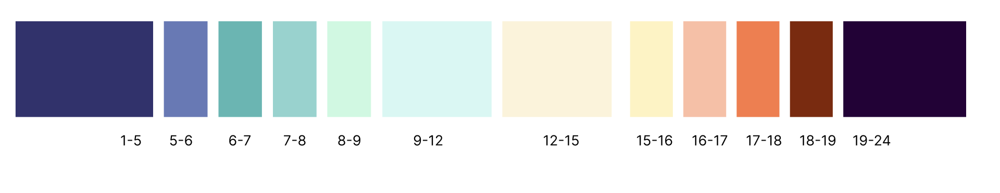

# Assignment 3 : Breath Clock

## Abstract Clock, Week 5 Assignment

---

## Concept

I wanted to create a clock that doesn’t tell time in a literal way, but instead expresses how time feels.
Using a breathing animation at the center and a color-changing background that reflects the sky throughout the day, I explored the passage of time as something ambient and meditative.

The 12 pulsing circles expand and contract together like a breath. Each second, minute, and hour is mapped onto different visual elements: motion, color, and background. A 24-hour timeline at the bottom left shows the sky colors for the entire day, with a triangle pointing to the current hour.

This project is not meant to be “read” like a traditional clock, but to give a sense of time gently passing—quietly changing, but always in motion.

---

## Progress

### I start from Breath Animation.

In class, the practice template was based on **12 small circles evenly spaced on a circle**.
I noticed that when these circles grew large enough to overlap, the shape became interesting.
By dynamically changing their diameter with a sine curve (`sin()`), I achieved a **slow inhale/exhale rhythm**.
With `draw()` running at ~60 fps, this gave a smooth “breathing” effect.


### accidentally found "Rotating Donut"

While debugging the breathing animation, I tried replacing the **fixed base radius** with `circleX` and `circleY`—values originally meant for (x,y) position of the orbiting little ball.

I wasn’t sure what would happen—just experimenting—but it created a **rotating, expanding donut** effect driven by the current second.


You can check out animated "donut" here:


(The size of the donut base on `second();` of current time)

Here’s the code of the sketch:

```
let circleD = 25;

//x axis
let circleX;
let thetaX = 0;
let radiusX = 100;

//y axis
let circleY;
let thetaY = 0;
let radiusY = 100;

function setup() {
  createCanvas(windowWidth, windowHeight);
}

function draw() {
  background(0, 30);

  let r = map(second(), 0, 60, 0, width / 2);

  radiusX = r;
  radiusY = r;

  circleX = cos(radians(thetaX)) * radiusX;
  thetaX++; //++ adds one to existing var

  circleY = sin(radians(thetaY)) * radiusY;
  thetaY++;

  translate(width / 2, height / 2);

  fill("#ffffff10");
  stroke("#ffff63ff");

  // When creating the breathing animation, I originally arranged 12 small circles evenly around a fixed circular path.
  // Then I experimented by replacing the fixed radius with `circleX` and `circleY` — two values that change based on the current second().
  // (I wasn’t sure what would happen, just wanted to try it out.)
  // This unexpectedly created a rotating "donut" effect — I’m sure there’s some math behind it, but it’s beyond my current understanding!

  for (let i = 0; i < 60; i++) {
    let theta = i * (360 / 60);
    let radius = second() * 10;
    let x = cos(radians(theta)) * circleX;
    let y = sin(radians(theta)) * circleY;
    circle(x, y, radius);
  }
}

```

I can’t fully explain the math behind this (multiple sine/cosine interactions?), but it was a happy accident.
Later I decided to return to the original breathing clock idea and to enrich it with more effects.

### Adding Three Groups of Moving Circles

To enrich the scene, I introduced three new groups:

- **Outer-to-inner group**: shrinking radius but circles getting larger over time.

```
  // ===== Create a Radius That Shrinks Over Each Minute =====
  // R shrinks from width/3 to 0 as seconds progress
  let R = map(second(), 0, 60, width / 3, 0);

  // ===== From Outer to Inner: Growing Circles =====
  // As time passes, the circles shrink inward with radius based on current second
  for (let i = 0; i < 12; i++) {
    let theta = i * (TWO_PI / 12);
    let radius = 4 * second(); // every circle's diameter get bigger over time
    let x = cos(theta) * R;
    let y = sin(theta) * R;
    circle(x, y, radius);
  }
```

- **Inner-to-outer group**: growing radius but circles getting smaller over time.

```
 // ===== Outward Growing System with Shrinking Balls =====
  // This section reverses: the radius increases over time while balls shrink
  // r grows from 0 to width/3 as seconds progress
  let r = map(second(), 0, 60, 0, width / 3);
  for (let i = 0; i < 12; i++) {
    let theta = i * (TWO_PI / 12);
    let radius = 480 / second(); // every circle's diameter get smaller over time
    let x = cos(theta) * r;
    let y = sin(theta) * r;
    circle(x, y, radius);
  }
```

- **Orbiting circle**: a single ball rotating around the center, one full revolution every 2 seconds (120 frames at 60 fps).

```
  // ===== Draw Orbiting Circle =====
  //Orbiting position calculation using cosine and sine
  // This creates a circular movement path
  circleX = (cos(thetaOrbit) * width) / 4;
  circleY = (sin(thetaOrbit) * width) / 4;
  // One full orbit every 2 seconds (60 fps * 2 = 120 frames)
  let speed = TWO_PI / 120;
  thetaOrbit += speed;
  // Draw the orbiting circle
  circle(circleY, circleX, circleD);
```

Each group is driven by simple loops and `second()` time mappings.

- Subtle Blue-Green color shifts, based on second()和 minute().

Because blue-green feels meditative, I fixed `r = 0` and mapped `minute()` and `second()` to G and B channels:

```
  // The red value is fixed at 0, but green and blue change based on real time.
  // map() function scales time values to RGB ranges for subtle color shifts.
  let colorR = 0;
  let colorG = map(minute(), 0, 60, 150, 210); // Green slowly changes over 1 hour
  let colorB = map(second(), 0, 60, 150, 210); // Blue changes every minute
```

This produces a **subtle shifting fill color** as time passes.

### Sky Themed Background System,based on hour()

I wanted the background to indicate **time of day**.
I built a sky color palette (see image below).

And I used an `if` statement in `getSkyColor(h)` to return the appropriate color.
Then I call `background(bgColor, 30)` each frame to apply it with transparency.

### added 24-Hour Timeline

To make the sky-color changes visible without waiting hours, I added a **timeline bar** at the bottom-left:

- Each block = one hour.
- Each block’s color = `getSkyColor(h)`.
- A small triangle indicates the **current hour**.

This is handled by a custom function `drawTimeline()`.

---

## Key p5.js Functions Used

- `setup()` / `draw()` – standard p5.js structure for animation
- `minute()`, `second()`, `hour()` – to get real-time values
- `sin()`, `cos()` – for circular motion and breathing curves
- `map()` – to map time values into color/size ranges
- `abs()` – to ensure positive values for circle sizes
- `translate()` – to draw from the center of the canvas
- `for` loops – to repeat drawing of circles efficiently
- custom functions `getSkyColor()` and `drawTimeline()` – to organize code

---
