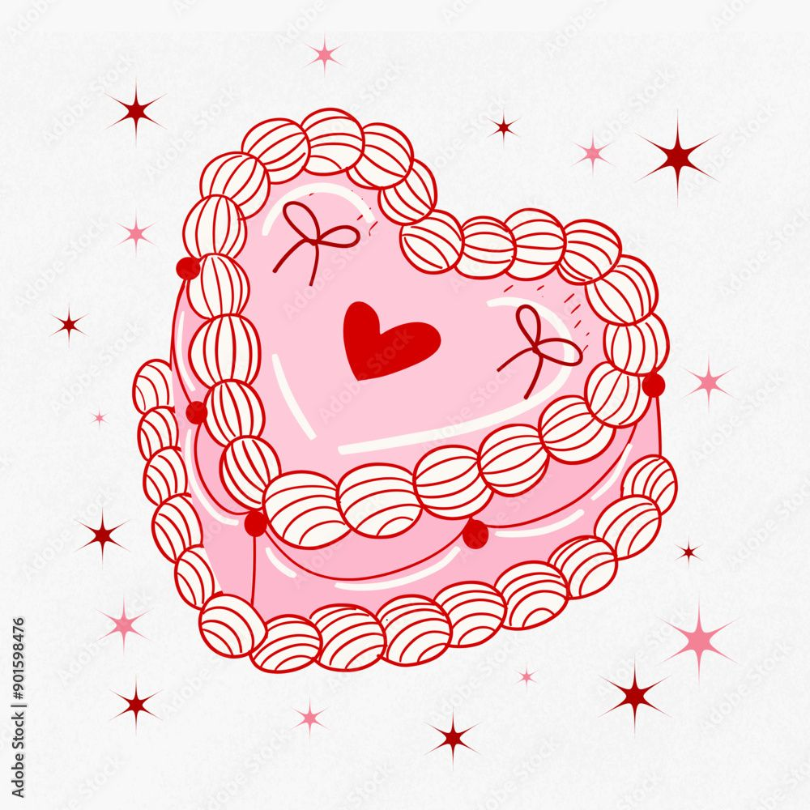

# Assignment 4 : Cake Factory

## Object Factory, Week 6-7 Assignment

---

## Concept

Basically, I want to draw cakes. Because cake is same as pizza with round shape and have a lot of variable decoration on the top. I searched for some vintage style reference pictures on Pinterest for color inspiration.


[link of reference1](https://www.pinterest.com/pin/10766486606331845/)


[link of reference2](https://www.pinterest.com/pin/3166662232308631/)

But I didn't fully draw my cakes as same as these, these are to fancy for the assignment. Just get a vintage cake vibe.

## Progress

### Circle to Ellipse

Because cakes are usually drawn with a slight top-down angle, the circular top looks like an ellipse.
Start with Change Circle Path of Polar Coordinates to Ellipse Path.
For a circle, the parametric equation describes a point moving around the center at an equal distance in every direction.
For an ellipse, it’s almost the same idea, but the distance in the horizontal and vertical directions is different. Instead of one radius r, we have two: a for the x-axis and b for the y-axis.
So to get the polar coordinates of a ellipse, we only change the scale, the x value follows the width, and the y value follows the height.

With this mathematical formula, I tried to draw a cake with a plate in `draw()` function.

### Put parameters and drawing function into cake class.

I create a cake class.
And put variables into parameters. Put everything inside draw function into a method. And separate them to `drawPlate()` and `drawCakeBase()`

### Draw the Cake Base with Two Ellipse and a Rectangle

1. random size
   Making variable in the ellipse and rectangle relevant to each other, base on ellipse's width.

2. random color
   I set the colorMode to HSB in `setup();`, because I need a lot of changing color HUE with same saturation and brightness.
   for example for the cake base:
   `fill(this.baseHue, 30, 100);`
   and top layer with a lighter color:
   `fill(this.baseHue, 20, 100);`

   and when creating a new object, I pass a random hue value `random(0, 360)` pass a HUE value to instance property `this.baseHue`.

### Draw the Plate

1. random color, connected with cake base
   Plate also have color connection with cake base. But I slightly changed it with `fill(this.baseHue * 3, 30, 60);`

### push object in to array, with `mousePressed()`

I defined a global variable called cakes at the top of the code. It’s an empty array that stores all the cake objects.
inside the mousePressed(), I create new cakes objects, and push them into array.

```
let tempCake = new Cake(
//===== cake base =====
mouseX, // x pos of Ellipse1, cake plate center
mouseY, //y pos of Ellipse1, cake plate center

      random(0, 360), //color of base cake
    );
    //take my newly created cake and add it to my cakes array
    cakes.push(tempCake);
```

### Draw the Cream on the top

Go back to the class get more decorations for the cake. I decide that every cake in my factory come with cream top and a colorful cream around the bottom. And creams are just like number texts in clock assignment.

1. Polar coordinates with ellipse. For each small cream piece, the position is calculated using the ellipse’s parametric idea: start from the cake center, move horizontally by width × cosine(angle) and vertically by height × sine(angle). By looping through multiple angles, the points are evenly distributed along the elliptical path.

2. I drew two sets of cream loops: One on the top surface. One around the bottom half of the cake.

### Draw Three Type of Decorations

I define three methods in side the class for cake decoration.“to prepare for the type-checking logic used when creating different cakes.

1.`mango()` for mango pieces.
How to put mango pieces in the cake top area?
I use `mangoPositions = []` array in class constructor. And a for loop and a polar coordinates with random inside it.

2. `lemon()` to lemon on the top of the cream.
   Most as same as cream. Add some offset on the y position. And change ellipse to arc.

3. `HEDText()` for Happy EveryDay text with a candle on it.
   I want to draw a animated fire. And it looks like drunk walk example, so I learned from that, add some random value to the fire position
   I want the candle size dependent on the cake size, so I use `hEllipse` as a reference.

What special is that I put a animated fire on the top of candle.
I feel fire animation really looks like drunk walk example, so I learned from that, add some random value to the fire position X and Y.

### Type Changing with `keyPressed()`

Also using template on the class.
When a key is pressed, the keyPressed() function updates the global variable decoType, which controls what kind of decoration each new cake will have.

1. At the top of the sketch, a global variable named decoType is initialized as "cream".
   This variable stores the current decoration mode. Every time a new cake is created (in mousePressed()), this variable determines what type of topping will be drawn.

2. The keyPressed() function listens for keys and updates the decoration type:

```
function keyPressed() {
  if (key === "m") {
    decoType = "mango";
  } else if (key === "l") {
    decoType = "lemon";
  } else if (key === "h") {
    decoType = "HEDText";
  } else if (key === "c") {
    decoType = "cream";
  }
}
```

3. When the user clicks to create a new cake, the current `decoType` value is passed into the cake class constructor. Inside the `draw()` loop, the code checks each cake’s `decoType` and calls the corresponding drawing function (`mango()`, `lemon()`, `HEDText()`, or just `cream()`).

### click on the top of cake to delete the cake

Also using template on the class.

1. Add a `this.hovering`instance property and a `checkHover()` method in the cake class, using `let d = dist(mouseX, mouseY, this.xEllipse, this.yEllipseTop);`to detect the distance between mouse position and the center of cake top surface.

2. This check runs every frame inside the draw() loop, so each cake continuously knows whether it’s being hovered over.

array.splice and hovering detection.

3. When the mouse is pressed, the program loops through all cakes to check which one is currently being hovered. If hovering is true for any cake, It removes that cake from the global cakes array using `cakes.splice(i, 1)`. The splice method deletes one element (the clicked cake) at index i.

4. If no cake is hovered (amIHovering == false), a new cake is created at the mouse position instead.

5. I also put the background color and text prompts inside the draw() function, so they are constantly refreshed without being affected.
